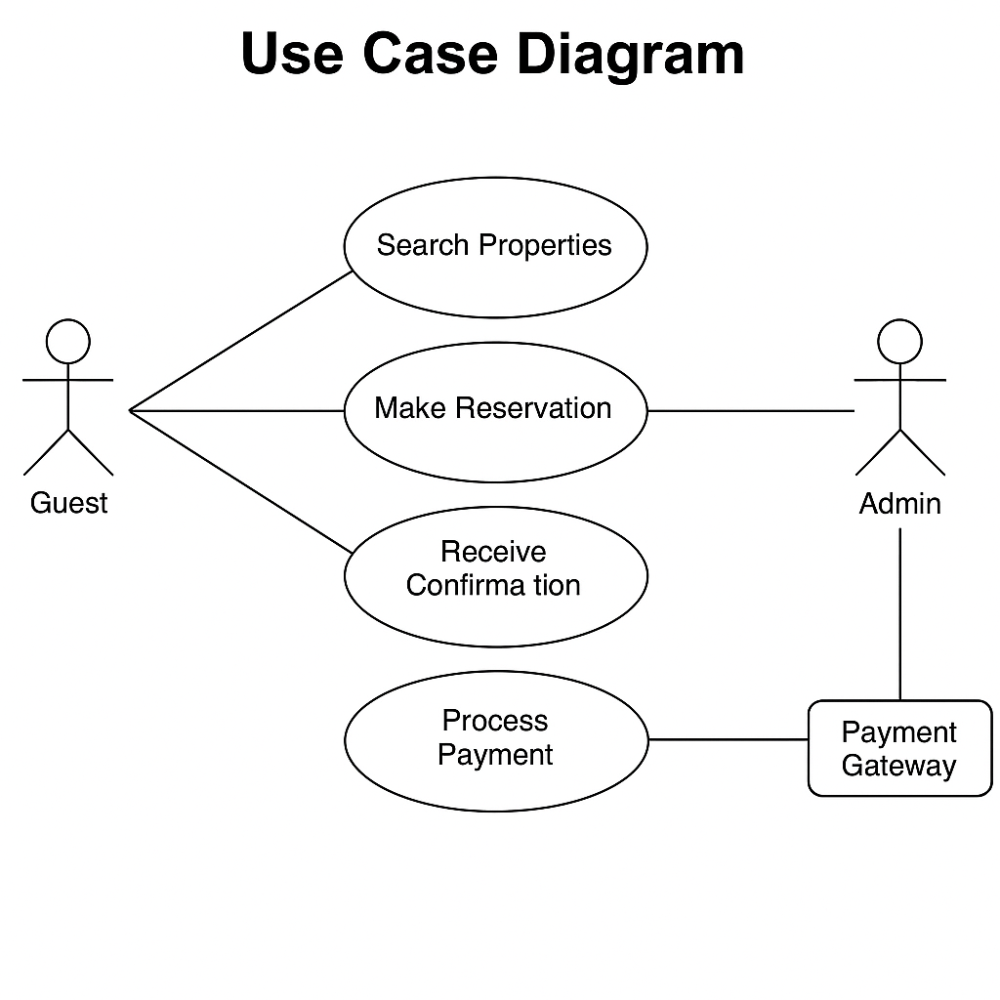

# 📋 Requirement Analysis in Software Development

## 🧾 Introduction
This repository delves into the Requirement Analysis phase of the Software Development Life Cycle (SDLC), emphasizing its significance in building robust systems. It encompasses theoretical insights, structured outlines, use case modeling, and practical examples pertinent to real-world projects, such as a booking management system.

## ❓ What is Requirement Analysis?
Requirement Analysis is the systematic process of identifying, documenting, and validating the needs and expectations of stakeholders for a software system. It serves as a bridge between clients and the development team, laying the foundation for successful project execution.

### Importance in SDLC:
- Ensures a clear understanding of system functionalities.
- Minimizes miscommunication and scope creep.
- Aids in accurate scope, timeline, and cost estimation.
- Facilitates quality assurance and stakeholder satisfaction.

## 🚀 Why is Requirement Analysis Important?
### Clarity and Understanding
Establishes a clear direction for the development team by eliminating ambiguities.

### Reduced Development Costs
Identifying and resolving misunderstandings early reduces the cost of changes during later development stages.

### Enhanced Project Planning
Well-documented requirements assist in better timeline estimation, task division, and resource allocation.

## 🛠️ Key Activities in Requirement Analysis
- **Requirement Gathering:** Collecting initial data from stakeholders through interviews, questionnaires, or workshops.
- **Requirement Elicitation:** Exploring stakeholder needs by asking pertinent questions to uncover hidden expectations.
- **Requirement Documentation:** Clearly articulating all functional and non-functional requirements in an understandable format.
- **Requirement Analysis and Modeling:** Organizing and structuring requirements using diagrams and models like use case diagrams or user stories.
- **Requirement Validation:** Ensuring documented requirements accurately reflect stakeholder expectations and are feasible to implement.

## 🔍 Types of Requirements

### ✅ Functional Requirements
Functional requirements define specific behaviors or functions of the system.

**Examples (for booking management project):**
- Users can search for available properties based on location, date, and price.
- Guests can make reservations and receive confirmation emails.
- Admins can add, edit, or delete property listings.
- Users can process payments through integrated payment gateways.
- System generates booking history and invoices for users.

### ⚙️ Non-functional Requirements
Non-functional requirements describe how the system performs its functions, focusing on performance, usability, reliability, etc.

**Examples (for booking management project):**
- The platform must be available 99.9% of the time.
- Pages should load within 2 seconds under standard load conditions.
- User data must be encrypted and stored securely, complying with GDPR standards.
- The system should handle up to 10,000 concurrent users without performance degradation.
- The application should be accessible on various devices, including desktops, tablets, and smartphones.

## 🗂️ Use Case Diagrams
Use Case Diagrams visually represent the interactions between users (actors) and the system, outlining various ways users achieve goals with the software.

### 📌 Benefits:
- Simplifies visualization of system functionality.
- Identifies all user roles and their interactions.
- Helps developers and stakeholders stay aligned.

## ✅ Acceptance Criteria
Acceptance Criteria define the conditions that a software product must meet to be accepted by a user, customer, or other systems.

### 📌 Importance:
- Provide a clear, testable standard for feature completion.
- Ensure alignment between stakeholders and developers.
- Help developers understand what “done” means from the user’s perspective.

### 🛒 Example — Checkout Feature
- The user must be logged in to complete checkout.
- Booking summary must include property name, price, and date range.
- The system must display a confirmation message upon successful booking.
- Payment must be securely processed with integrated payment gateways.
- Error messages must appear if payment fails or required fields are empty.
